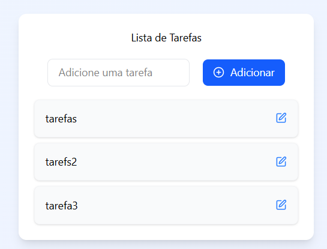

# 📋 To-Do List em React

Este é um projeto simples de lista de tarefas (To-Do List) desenvolvido com React. O objetivo é praticar conceitos como componentização, estados, e eventos no React.

🚧 Projeto em andamento...

## 🛠️ Tecnologias utilizadas

- React
- JavaScript
- Tailwind

## 📌 Funcionalidades atuais

- [x] Adicionar nova tarefa
- [x] Exibir lista de tarefa
- [x] Editar lista de tarefas
- [x] Marcar tarefa como concluída
- [x] Remover tarefa
- [ ] Salvar tarefas no localStorage
- [ ] Filtrar tarefas

## 📂 Prints



## ▶️ Como executar o projeto

1. Clone o repositório:

```bash
git clone https://github.com/Amanda-Berwig/ToDoList.git
```

2. Acesse a pasta do projeto:

```bash
cd ToDoList
```

3. Instale as dependências:

```bash
npm install
```

4. Execute o projeto:

```bash
npm run dev
```

5. Abra no navegador: http://localhost:5173
